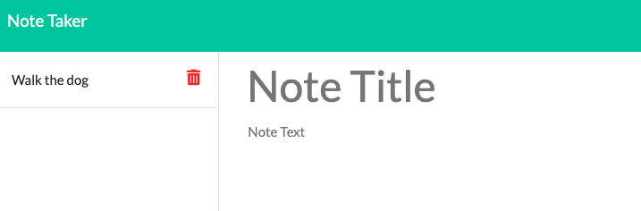

# Note Taker App
## A Handy Dandy Express App
https://hthomas93.github.io/note-taker/

## Purpose
The note taker app is a simple and streamlined solution to keeping your thoughts and tasks organized.

## User Story
AS A user, I want to be able to write and send notes.
I WANT to be able to delete notes I've written before and add new ones
SO THAT I can organize my thoughts and keep track of tasks that I need to complete.

## How it works
When the app is run, the user will click the "Get Started" page. The app will deploy to either the user's local branch or the hosting server.

This takes the user to the notes page.

The user can then fill in the title and description of the note. Notice, a save icon will appear once both fields have been filled. Click this button to save the note.

Once the user has saved the note, it will appear on the sidebar. If you click the delete icon, the note will disappear.

